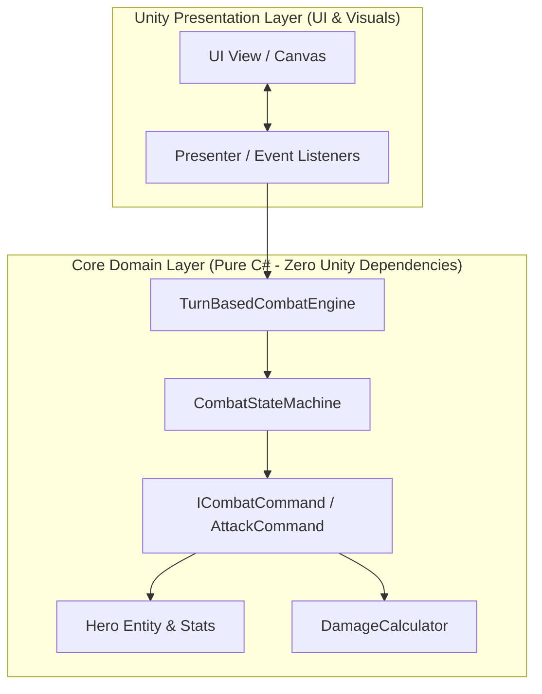

# 🏛️ Архитектура Проекта FantasyRPG

## 📐 Архитектурные Принципы (Core Principles)

Проект разрабатывается с соблюдением требований к высокопроизводительным и масштабируемым игровой системам:

1. **Clean Architecture (Чистая Архитектура):**
   - Доменная логика в папке `Assets/Scripts/Core/` на **100% изолирована** от Unity (`MonoBehaviour`, `UnityEngine.Object`, `Transform`, `GameObject` и т.д.).
   - Домен не имеет внешних зависимостей и может тестироваться обычными модульными тестами (NUnit / xUnit) без запуска редактора Unity.

2. **Zero-GC & High FPS Optimization:**
   - Аллокации памяти в основном игровом и боевом цикле сведены к минимуму.
   - Использование `readonly struct` для характеристик ([HeroStats.cs](../Assets/Scripts/Core/Stats/HeroStats.cs)), избегая мусора в куче (Heap GC Spikes).
   - Избежание ключевого слова `new` во время обновления кадров боя.

3. **Server-Authoritative Co-op (Сетевой Кооператив на 3 игроков):**
   - Авторитет всех боевых расчетов и переключений состояний принадлежит серверу.
   - Минимизация трафика: передача данных рас и ходов через компактные `byte` enums.

4. **Паттерн MVP (Model-View-Presenter) для UI:**
   - Модель (`Model`) — это доменный слой (`Hero`, `CombatEngine`).
   - Представление (`View`) — компоненты Unity UI (`Canvas`, `TMP_Text`, `Button`).
   - Презентер (`Presenter`) — связующее звено, подписывающееся на события домена.

---

## 📊 Общая диаграмма взаимодействия слоев

---

## 🔗 Сопутствующие разделы вики:
- 📊 [Модель Домена и Характеристики](./domain_model.md)
- 🔄 [Боевая Система и Машина Состояний](./combat_system.md)
- 🧝‍♂️ [Расы и Кооперативная Синергия](./races_and_synergies.md)
- 🗺️ [Дорожная Карта и Прогресс](./roadmap.md)
