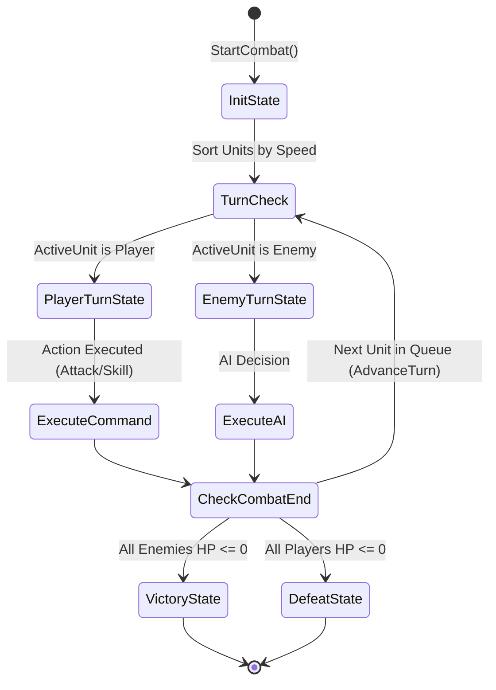
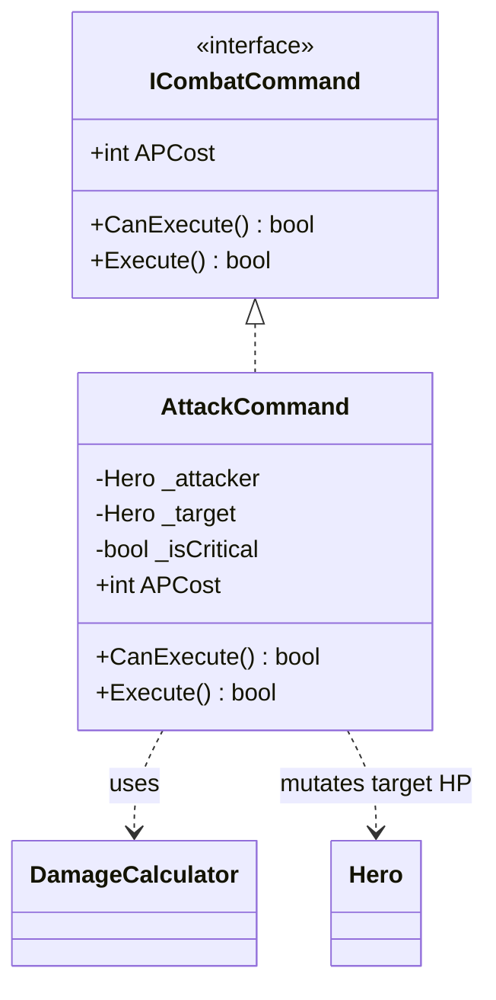

# 🔄 Боевая Система и Пошаговая Машина Состояний (Combat FSM)

## ⚔️ Обзор Боевой Системы

Боевая система представляет собой пошаговый движок ([TurnBasedCombatEngine.cs](file:///C:/Users/shtil/OneDrive/Desktop/FantasyRPG/Assets/Scripts/Core/Combat/TurnBasedCombatEngine.cs)), использующий конечный автомат состояний ([CombatStateMachine.cs](file:///C:/Users/shtil/OneDrive/Desktop/FantasyRPG/Assets/Scripts/Core/Combat/CombatStateMachine.cs)) и паттерн **Command** для изолированного выполнения каждого боевого действия.

---

## 🔄 Диаграмма переходов состояний (Combat FSM State Diagram)

---

## 📜 Состояния Боя (FSM States)

1. **[InitState.cs](file:///C:/Users/shtil/OneDrive/Desktop/FantasyRPG/Assets/Scripts/Core/Combat/InitState.cs):**
   - Инициализирует список участников боя, сортирует их по параметру `Speed`.

2. **[PlayerTurnState.cs](file:///C:/Users/shtil/OneDrive/Desktop/FantasyRPG/Assets/Scripts/Core/Combat/PlayerTurnState.cs):**
   - Состояние ожидания команды от игрока. Проверяет наличие очков `APCost`.

3. **[EnemyTurnState.cs](file:///C:/Users/shtil/OneDrive/Desktop/FantasyRPG/Assets/Scripts/Core/Combat/EnemyTurnState.cs):**
   - Автономный ход ИИ врага. Выбирает наиболее уязвимую цель и наносит урон.

4. **[VictoryState.cs](file:///C:/Users/shtil/OneDrive/Desktop/FantasyRPG/Assets/Scripts/Core/Combat/VictoryState.cs) & [DefeatState.cs](file:///C:/Users/shtil/OneDrive/Desktop/FantasyRPG/Assets/Scripts/Core/Combat/DefeatState.cs):**
   - Завершающие состояния при уничтожении вражеской команды или гибели отряда.

---

## ⚔️ Паттерн Команд (Command Pattern Flow)

Каждое действие в бою реализует интерфейс [ICombatCommand.cs](file:///C:/Users/shtil/OneDrive/Desktop/FantasyRPG/Assets/Scripts/Core/Combat/ICombatCommand.cs):

- **[AttackCommand.cs](file:///C:/Users/shtil/OneDrive/Desktop/FantasyRPG/Assets/Scripts/Core/Combat/AttackCommand.cs):** Принимает атакующего героя и цель, проверяет `CanExecute()` (живы ли оба участника), списывает AP и вызывает расчет через [DamageCalculator.cs](file:///C:/Users/shtil/OneDrive/Desktop/FantasyRPG/Assets/Scripts/Core/Stats/DamageCalculator.cs).

---

## 🔗 Сопутствующие разделы:
- 🏛️ [Архитектура Проекта](file:///C:/Users/shtil/OneDrive/Desktop/FantasyRPG/docs/architecture.md)
- 📊 [Модель Домена](file:///C:/Users/shtil/OneDrive/Desktop/FantasyRPG/docs/domain_model.md)
- 🧝‍♂️ [Расы и Синергия](file:///C:/Users/shtil/OneDrive/Desktop/FantasyRPG/docs/races_and_synergies.md)
