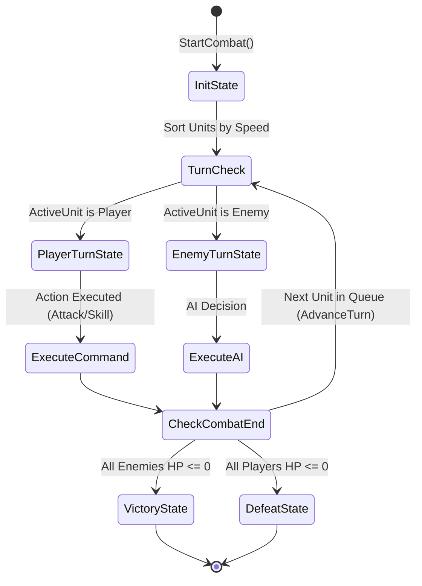
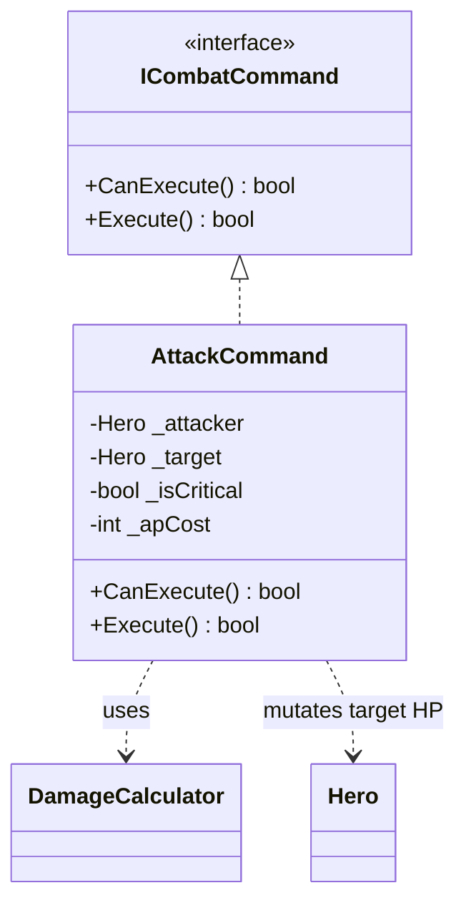

# 🔄 Боевая Система и Пошаговая Машина Состояний (Combat FSM)

## ⚔️ Обзор Боевой Системы

Боевая система представляет собой пошаговый движок ([TurnBasedCombatEngine.cs](../Assets/Scripts/Core/Combat/TurnBasedCombatEngine.cs)), использующий конечный автомат состояний ([CombatStateMachine.cs](../Assets/Scripts/Core/Combat/CombatStateMachine.cs)) и паттерн **Command** для изолированного выполнения каждого боевого действия.

---

## 🔄 Диаграмма переходов состояний (Combat FSM State Diagram)

---

## 📜 Состояния Боя (FSM States)

1. **[InitState.cs](../Assets/Scripts/Core/Combat/InitState.cs):**
   - Инициализирует список участников боя, сортирует их по параметру `Speed`.

2. **[PlayerTurnState.cs](../Assets/Scripts/Core/Combat/PlayerTurnState.cs):**
   - Состояние ожидания команды от игрока. `TrySpendAP` определён на `Hero` (не здесь — `PlayerTurnState` только вызывает `ResetActionPoints()` в `Enter()`) и вызывается из `AttackCommand.Execute()` при выполнении атаки. Подтверждено тестами `HeroTests.TrySpendAP_*` (2026-08-01) — расход AP подключён к выполнению команд, пункт Вехи 0 закрыт.

3. **[EnemyTurnState.cs](../Assets/Scripts/Core/Combat/EnemyTurnState.cs):**
   - Базовый каркас хода врага. На данный момент только выдает очки AP. Полноценный ИИ (Utility AI) и самостоятельный выбор целей будут реализованы в Сессии 3.

4. **[VictoryState.cs](../Assets/Scripts/Core/Combat/VictoryState.cs) & [DefeatState.cs](../Assets/Scripts/Core/Combat/DefeatState.cs):**
   - Завершающие состояния при уничтожении вражеской команды или гибели отряда.

---

## ⚔️ Паттерн Команд (Command Pattern Flow)

Каждое действие в бою реализует интерфейс [ICombatCommand.cs](../Assets/Scripts/Core/Combat/ICombatCommand.cs):

**Историческое расхождение с кодом (найдено аудитом 2026-07-29, исправлено 2026-08-01):** этот файл раньше показывал `APCost` как поле интерфейса `ICombatCommand`. В реальном коде (`Assets/Scripts/Core/Combat/ICombatCommand.cs`) интерфейс объявляет только `CanExecute()` и `Execute()` — `APCost` не является частью контракта, а живёт как отдельное публичное свойство на конкретной реализации (`AttackCommand.APCost`). Диаграмма выше соответствует фактическому коду. Если `APCost` должен стать частью интерфейса (чтобы FSM могла проверять стоимость любой команды до вызова `Execute()`), это отдельное архитектурное решение, а не опечатка в доке — обсудить и внести в интерфейс осознанно, а не молча.

- **[AttackCommand.cs](../Assets/Scripts/Core/Combat/AttackCommand.cs):** Принимает атакующего героя и цель, проверяет `CanExecute()` (живы ли оба участника — через `Hero.CurrentHealth`, а не устаревший путь `Hero.Stats.CurrentHealth`), списывает AP через `Hero.TrySpendAP(APCost)` и вызывает расчёт через [DamageCalculator.cs](../Assets/Scripts/Core/Stats/DamageCalculator.cs). Подтверждено `dotnet test` (2026-08-01) — `Execute()` реально тратит AP, это больше не расхождение.

---

## 🔗 Сопутствующие разделы:
- 🏛️ [Архитектура Проекта](docs/architecture.md)
- 📊 [Модель Домена](docs/domain_model.md)
- 🧝‍♂️ [Расы и Синергия](docs/races_and_synergies.md)
