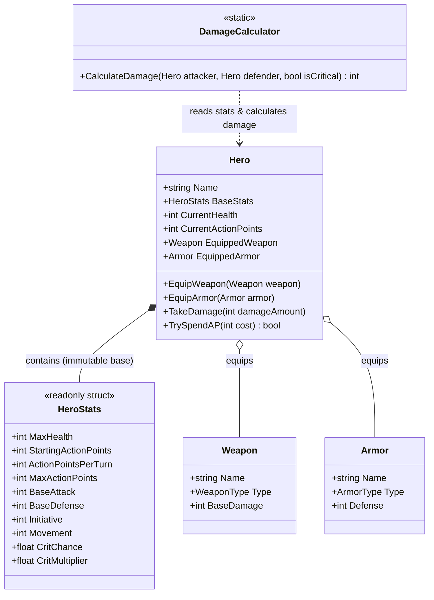

# 📊 Доменная Модель персонажей и предметов

## 🧬 Описание доменного слоя (Domain Core)

Доменный слой отвечает за сущности героев, их характеристики, предметы экипировки и формулы расчета физического/магического урона.

---

## 📊 Иерархия классов (Domain Class Diagram)

> **Внимание — диаграмма смешивает реализованное и принятое-но-не-реализованное.**
>
> Веха 0 реализована и подтверждена `dotnet build`/`dotnet test` 2026-08-01: `CurrentHealth` и
> `CurrentActionPoints` живут на `Hero`, а не внутри `readonly struct HeroStats` (до аудита
> 2026-07-29 здоровье лежало в структуре, что делало `TakeDamage` дорогим — пересоздание
> структуры целиком — и концептуально неверным).
>
> AP-модель (`StartingActionPoints`, `ActionPointsPerTurn`) и характеристика `Movement` —
> **принятый целевой дизайн [ADR-0002](./decisions/0002-action-points-and-movement-economy.md),
> ещё НЕ реализованный в коде.** До реализации `HeroStats` содержит прежние поля
> `MaxActionPoints` (в старом смысле «очки за ход») и `MoveSpeed`. Помечено по
> `.agents/rules/mentor_rules.md` §10: документация фиксирует направление ближайшего изменения,
> а не выдаёт его за факт.

---

## 📂 Компоненты домена

### 1. Базовые характеристики ([HeroStats.cs](../Assets/Scripts/Core/Stats/HeroStats.cs))

- `readonly struct` — но **только для неизменяемых базовых значений**. `CurrentHealth` и `CurrentActionPoints` сюда не входят — они меняются в течение боя и принадлежат `Hero`, а не struct-снапшоту (см. `code_review_rules.md` §5).
- Содержит:
  - `MaxHealth` — максимум здоровья (не текущее).
  - `StartingActionPoints` — AP героя в начале боя. **Целевой дизайн ADR-0002, в коде пока нет.**
  - `ActionPointsPerTurn` — AP, добавляемые в начале каждого последующего хода. **Целевой дизайн ADR-0002, в коде пока нет.**
  - `MaxActionPoints` — верхняя граница накопленного AP, а не количество AP, автоматически выдаваемое каждый ход. **Смысл поля меняется по ADR-0002**: в текущем коде это ещё «очки действий за ход».
  - `BaseAttack` / `BaseDefense` — атака и защита.
  - `Initiative` — порядок хода в бою. Разделено с движением: раньше оба смысла жили в одном поле `Speed`.
  - `Movement` — положительная целочисленная характеристика, модифицирующая стоимость **каждого ребра** движения по формуле `ceil(baseStepCost * 100 / Movement)`, где `baseStepCost` — `10` (ортогональное ребро) или `14` (диагональное). Нейтральное значение `100` даёт ровно базовые цены ADR-0001. Не влияет на инициативу, `StartingActionPoints`, `ActionPointsPerTurn` и `MaxActionPoints`. **Переименование из `MoveSpeed` и смена семантики приняты в ADR-0002, в коде пока `MoveSpeed` со старым смыслом «сколько клеток проходится за 1 AP».**
  - `CritChance` / `CritMultiplier` — вероятность и множитель критического урона.

### 2. Герой ([Hero.cs](../Assets/Scripts/Core/Stats/Hero.cs))

- Центральный доменный класс. Хранит неизменяемый `BaseStats` и изменяемые `CurrentHealth`/`CurrentActionPoints` как собственные поля с `{ get; private set; }`.
- Отвечает за экипировку оружия ([Weapon.cs](../Assets/Scripts/Core/Items/Weapon.cs)) и брони ([Armor.cs](../Assets/Scripts/Core/Items/Armor.cs)).
- Метод `TakeDamage(int amount)` пересчитывает здоровье без пересоздания всей структуры характеристик. Подтверждено тестами `HeroTests.TakeDamage_*` (обычный урон и clamp к `0` при смертельном).
- Метод `TrySpendAP(int cost)` изменяет AP только при достаточном остатке; неуспешная попытка не меняет состояние. Вызывается из `AttackCommand.Execute()` (см. `docs/combat_system.md`) — подтверждено тестами `HeroTests.TrySpendAP_*`.
- **Целевой дизайн ADR-0002, ещё не реализован:** в начале боя `CurrentActionPoints = StartingActionPoints`; в начале последующих ходов AP обновляются по формуле `min(CurrentActionPoints + ActionPointsPerTurn, MaxActionPoints)`; неиспользованный остаток переносится между ходами в пределах `MaxActionPoints`.

### 3. Калькулятор урона ([DamageCalculator.cs](../Assets/Scripts/Core/Stats/DamageCalculator.cs))

- Чистый статический класс.
- Формула базового урона:
  $$\text{Damage} = \max(1, (\text{Attacker.BaseAttack} + \text{Weapon.BaseDamage}) - (\text{Defender.BaseDefense} + \text{Armor.Defense}))$$
- При крите результат умножается на `CritMultiplier`. `CritChance` читается внутри `DamageCalculator` через seeded `Random` — подтверждено тестом `DamageCalculatorTests.CalculateDamage_GuaranteedCrit_...` (2026-08-01). Первая версия — один тип магического урона поверх физического; полная матрица из 5 типов урона и открытых сопротивлений сознательно отложена (см. `docs/roadmap.md`, таблица вырезанного).

---

## 🔗 Сопутствующие разделы:
- 🏛️ [Архитектура Проекта](./architecture.md)
- 🔄 [Боевая Система и FSM](./combat_system.md)
- 🧝‍♂️ [Расы и Синергия](./races_and_synergies.md)
- 📐 [Принятые решения (ADR)](./decisions/README.md) — в частности [ADR-0002: AP-экономика и `Movement`](./decisions/0002-action-points-and-movement-economy.md)
