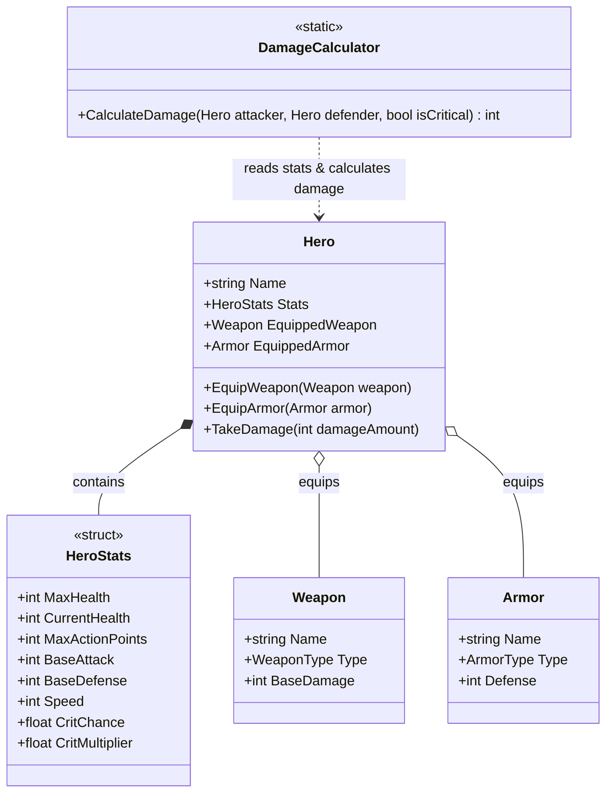

# 📊 Доменная Модель персонажей и предметов

## 🧬 Описание доменного слоя (Domain Core)

Доменный слой отвечает за сущности героев, их характеристики, предметы экипировки и формулы расчета физического/магического урона.

---

## 📊 Иерархия классов (Domain Class Diagram)

---

## 📂 Компоненты домена

### 1. Характеристики Героя ([HeroStats.cs](file:///C:/Users/shtil/OneDrive/Desktop/FantasyRPG/Assets/Scripts/Core/Stats/HeroStats.cs))
- Оформлен как `readonly struct` для гарантии **Zero-GC** при получении урона и изменении параметров.
- Содержит базовые атрибуты:
  - `MaxHealth` / `CurrentHealth` — здоровье.
  - `MaxActionPoints` — очки действий за ход (AP).
  - `BaseAttack` / `BaseDefense` — атака и защита.
  - `Speed` — скорость, определяющая порядок хода в бою.
  - `CritChance` / `CritMultiplier` — вероятность и множитель критического урона.

### 2. Герой ([Hero.cs](file:///C:/Users/shtil/OneDrive/Desktop/FantasyRPG/Assets/Scripts/Core/Stats/Hero.cs))
- Центральный доменный класс.
- Отвечает за экипировку оружия ([Weapon.cs](file:///C:/Users/shtil/OneDrive/Desktop/FantasyRPG/Assets/Scripts/Core/Items/Weapon.cs)) и брони ([Armor.cs](file:///C:/Users/shtil/OneDrive/Desktop/FantasyRPG/Assets/Scripts/Core/Items/Armor.cs)).
- Метод `TakeDamage(int amount)` пересчитывает здоровье без создания мусора в куче.

### 3. Калькулятор урона ([DamageCalculator.cs](file:///C:/Users/shtil/OneDrive/Desktop/FantasyRPG/Assets/Scripts/Core/Stats/DamageCalculator.cs))
- Чистый статический класс.
- Формула базового урона:
  $$\text{Damage} = \max(1, (\text{Attacker.BaseAttack} + \text{Weapon.BaseDamage}) - (\text{Defender.BaseDefense} + \text{Armor.Defense}))$$
- При крите результат умножается на `CritMultiplier`.

---

## 🔗 Сопутствующие разделы:
- 🏛️ [Архитектура Проекта](file:///C:/Users/shtil/OneDrive/Desktop/FantasyRPG/docs/architecture.md)
- 🔄 [Боевая Система и FSM](file:///C:/Users/shtil/OneDrive/Desktop/FantasyRPG/docs/combat_system.md)
- 🧝‍♂️ [Расы и Синергия](file:///C:/Users/shtil/OneDrive/Desktop/FantasyRPG/docs/races_and_synergies.md)
