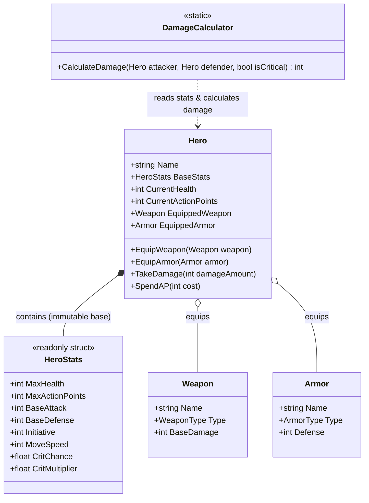

# 📊 Доменная Модель персонажей и предметов

## 🧬 Описание доменного слоя (Domain Core)

Доменный слой отвечает за сущности героев, их характеристики, предметы экипировки и формулы расчета физического/магического урона.

---

## 📊 Иерархия классов (Domain Class Diagram)

> Целевой дизайн Вехи 0 (см. `docs/roadmap.md`) — **и теперь также текущее состояние кода**,
> подтверждённое `dotnet build`/`dotnet test` 2026-08-01. До этого (на момент аудита 2026-07-29)
> `CurrentHealth` физически лежал внутри `readonly struct HeroStats`, что делало `TakeDamage`
> дорогим (пересоздание структуры целиком) и концептуально неверным — здоровье меняется и
> имеет идентичность, а не является неизменяемым значением. Диаграмма ниже больше не описывает
> будущее — она описывает то, что уже есть в `Assets/Scripts/Core/Stats/`.

---

## 📂 Компоненты домена

### 1. Базовые характеристики ([HeroStats.cs](../Assets/Scripts/Core/Stats/HeroStats.cs))
- `readonly struct` — но **только для неизменяемых базовых значений**. `CurrentHealth` и `CurrentActionPoints` сюда не входят — они меняются в течение боя и принадлежат `Hero`, а не struct-снапшоту (см. `code_review_rules.md` §5).
- Содержит:
  - `MaxHealth` — максимум здоровья (не текущее).
  - `MaxActionPoints` — очки действий за ход (AP).
  - `BaseAttack` / `BaseDefense` — атака и защита.
  - `Initiative` — порядок хода в бою.
  - `MoveSpeed` — сколько клеток проходится за 1 AP движения. Разделено с `Initiative`: раньше оба смысла жили в одном поле `Speed`.
  - `CritChance` / `CritMultiplier` — вероятность и множитель критического урона.

### 2. Герой ([Hero.cs](../Assets/Scripts/Core/Stats/Hero.cs))
- Центральный доменный класс. Хранит неизменяемый `BaseStats` и изменяемые `CurrentHealth`/`CurrentActionPoints` как собственные поля с `{ get; private set; }`.
- Отвечает за экипировку оружия ([Weapon.cs](../Assets/Scripts/Core/Items/Weapon.cs)) и брони ([Armor.cs](../Assets/Scripts/Core/Items/Armor.cs)).
- Метод `TakeDamage(int amount)` пересчитывает здоровье без пересоздания всей структуры характеристик. Подтверждено тестами `HeroTests.TakeDamage_*` (обычный урон и clamp к `0` при смертельном).
- Метод `TrySpendAP(int cost)` вызывается из `AttackCommand.Execute()` (см. `docs/combat_system.md`) — подтверждено тестами `HeroTests.TrySpendAP_*`.

### 3. Калькулятор урона ([DamageCalculator.cs](../Assets/Scripts/Core/Stats/DamageCalculator.cs))
- Чистый статический класс.
- Формула базового урона:
  $$\text{Damage} = \max(1, (\text{Attacker.BaseAttack} + \text{Weapon.BaseDamage}) - (\text{Defender.BaseDefense} + \text{Armor.Defense}))$$
- При крите результат умножается на `CritMultiplier`. `CritChance` читается внутри `DamageCalculator` через seeded `Random` — подтверждено тестом `DamageCalculatorTests.CalculateDamage_GuaranteedCrit_...` (2026-08-01). Первая версия — один тип магического урона поверх физического; полная матрица из 5 типов урона и открытых сопротивлений сознательно отложена (см. `docs/roadmap.md`, таблица вырезанного).

---

## 🔗 Сопутствующие разделы:
- 🏛️ [Архитектура Проекта](./architecture.md)
- 🔄 [Боевая Система и FSM](./combat_system.md)
- 🧝‍♂️ [Расы и Синергия](./races_and_synergies.md)
