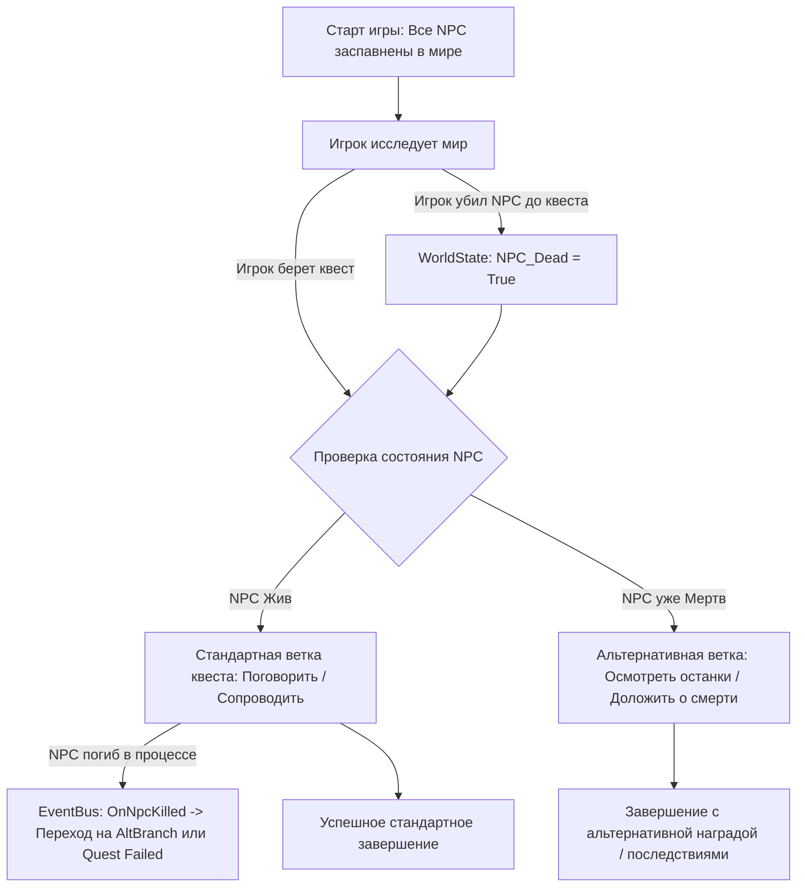

# 📜 Подсистема Квестов и Динамического Мира (Persistent World Quests)

## 🎯 Концепция persistent мира (Kingdom Come: Deliverance Style)

В отличие от классических RPG, где квестовые NPC спавнятся по скрипту в момент выдачи задания, в **FantasyRPG** реализована концепция **персистентного мира (Persistent World State)**:

1. **Спавн до взятия квеста:** Все ключевые NPC и квестодатели присутствуют в игровом мире с самого старта сессии, независимо от состояния квестов.
2. **Свобода действий и эмерджентность:** Игрок может случайно или намеренно убить или вступить в бой с ключевым NPC еще **до того**, как узнает о существовании связанного с ним квеста.
3. **Адаптивные ветвления и Fail-Safe механизмы:** 
   - Если ключевой NPC мертв на момент принятия квеста, движок не ломается, а переводит квест в альтернативную ветку (например: *«Обследовать тело убитого»*, *«Найти дневник усопшего»* или *«Доложить заказчику об авантюрном убийстве»*).
   - Если NPC погибает во время выполнения задания, подсистема через **Event Bus** моментально обновляет цели активного квеста.

---

## 🔄 Схема работы реактивного состояния квеста (Mermaid Flow)



---

## 🏛️ Архитектура подсистемы квестов (Core Design)

### 1. `WorldStateRepository` (Репозиторий состояния мира)
- Отслеживает глобальный реестр всех NPC и их текущее состояние (Alive, Dead, Hostile, Fled).
- Сохраняет историю действий игроков для сетевого кооператива (Server-Authoritative).

### 2. `QuestObjective` (Цель квеста)
- Поддерживает флаги проверки предусловий (`PreConditionCheck`).
- Проверяет текущее состояние целевого NPC при активации этапа квеста:
  ```csharp
  if (WorldState.IsNpcDead(targetNpcId))
  {
      SwitchToAlternativeObjective(fallbackObjectiveId);
  }
  ```

### 3. `EventBus` & `OnNpcKilledEvent`
- При гибели любого персонажа в бою движок `TurnBasedCombatEngine` через `EventBus` рассылает событие `OnNpcKilledEvent(npcId)`.
- Реактивные квесты подписываются на событие и корректно обновляют свои цели без опроса в цикле.

---

## 🔗 Сопутствующие разделы:
- 🏛️ [Архитектура Проекта](file:///C:/Users/shtil/OneDrive/Desktop/FantasyRPG/docs/architecture.md)
- 📊 [Модель Домена](file:///C:/Users/shtil/OneDrive/Desktop/FantasyRPG/docs/domain_model.md)
- 🔄 [Боевая Система](file:///C:/Users/shtil/OneDrive/Desktop/FantasyRPG/docs/combat_system.md)
- 🧝‍♂️ [Расы и Синергия](file:///C:/Users/shtil/OneDrive/Desktop/FantasyRPG/docs/races_and_synergies.md)
- 🗺️ [Дорожная Карта](file:///C:/Users/shtil/OneDrive/Desktop/FantasyRPG/docs/roadmap.md)
